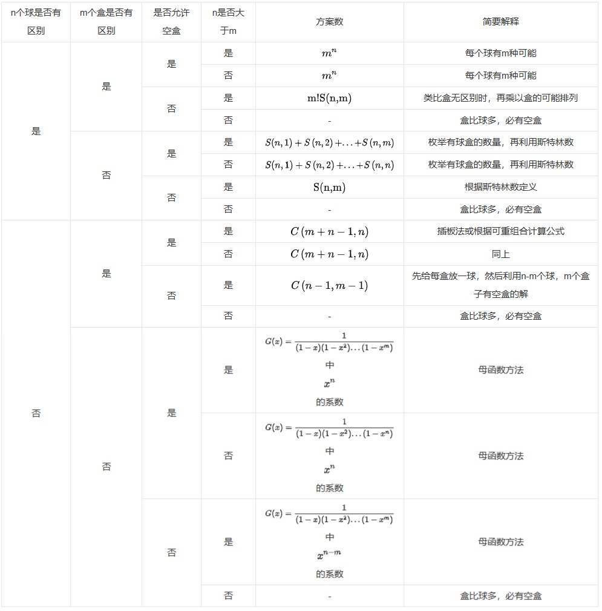

# 组合数

## 求 $C_n^k$

```cpp
gg C[MAX];
void Cvalue(gg n){
    C[0] = 1;
    for (gg i = 1; i <= n; ++i){
        C[i] = C[i - 1] * (n - i + 1) % mod * powMod(i, mod - 2, mod) % mod;
    }
}
```

## 求 1~n 内所有的 $C_n^k$ 的值

```cpp
gg C[MAX][MAX];
void Cvalue(gg n){
    for (gg i = 0; i <= n; ++i) {
        C[i][0] = 1;
        for (gg j = 1; j <= i; ++j){
            C[i][j] = (C[i - 1][j - 1] + C[i - 1][j]) % mod;
        }
    }
}
```

## 小球放盒子问题

放球问题是指把 n 个球放到 m 个盒子里的方案数，可分成 16 个子问题。不同情况总结见下表[^1]。



[^1]: https://baike.baidu.com/item/%E6%94%BE%E7%90%83%E9%97%AE%E9%A2%98/12740706
